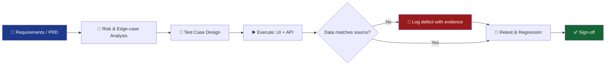

<!-- ===================== HERO ===================== -->

 

 

<!-- ===================== 5-SECOND PITCH ===================== -->

> ### 🧠 *"I test the workflow, the data behind it, and the edge cases real users will find."*

| 🎯 Role | 🏦 Domain | 🔌 Strength | 📍 Location |
| :---: | :---: | :---: | :---: |
| QA Engineer | FinTech · AI · IDP · KYC | API + Data Validation | Pune, India |

---

## ⚡ Why teams work well with me

<table>
<tr>
<td width="33%" valign="top">

### 🔍 Evidence-first bugs
Every defect I log has steps, expected vs actual, screenshots and source proof. Developers fix faster, nobody argues.

</td>
<td width="33%" valign="top">

### 🧬 Data-level testing
I don't stop at the UI. I compare **API response ↔ UI ↔ source PDF** to catch the mismatches that slip through.

</td>
<td width="33%" valign="top">

### 🤖 AI-output skeptic
OCR and LLM extraction can look right and still be wrong. I validate every field against ground truth.

</td>
</tr>
</table>

---

## 📊 QA Impact 

| 🐞 **100+** | 📝 **50+** | 🔁 **30+** | 🏦 **50–60** | ✅ **120+** |
| :---: | :---: | :---: | :---: | :---: |
| Jira defects documented, tracked & retested | Test-case sheets from requirements & PRDs | Regression & change-validation cycles | Bank-statement formats across 4 markets | Manual test cases executed at UptoSkills |

---

## 🧰 Tech & Tools

  

-2EAD33?style=flat-square&logo=playwright&logoColor=white)

---

## 🔬 How I test (my workflow)

---

## 🎯 Current Focus

- 🔍 Manual, functional, regression, smoke, sanity & end-to-end testing
- 🔌 REST API testing with Postman, JSON validation & API chaining
- 📄 OCR and LLM output validation for financial documents
- 🏦 FinTech, Intelligent Document Processing & KYC/eKYC workflows
- 🐍 Python scripting for repetitive QA and test-data prep
- 🚀 Building automation skills with **Playwright + TypeScript**

---

## 🐞 Sample: how I write a defect

<b>Click to expand (format example)</b>

| Field | Detail |
| :--- | :--- |
| **Title** | Closing balance extracted incorrectly for multi-page statement |
| **Severity / Priority** | High / P1 |
| **Environment** | Staging · Chrome latest |
| **Steps** | 1. Upload 3-page bank statement PDF → 2. Wait for extraction → 3. Compare closing balance with page 3 |
| **Expected** | Closing balance matches source PDF |
| **Actual** | Value taken from page 2 |
| **Evidence** | Screenshot + API response JSON + source PDF page |
| **Impact** | Wrong balance can affect loan decision |

---

## 💼 Experience

### 🔹 QA Intern · PowerCred Technologies

<!-- ⬇️ PASTE YOUR REMAINING EXPERIENCE HERE (bullets for PowerCred, UptoSkills, education, certifications) -->

---

## 📈 GitHub Stats

---

## 🐍 Contribution Snake

<picture>
  <source media="(prefers-color-scheme: dark)" srcset="https://raw.githubusercontent.com/shahid9370/shahid9370/output/github-snake-dark.svg" />
  <source media="(prefers-color-scheme: light)" srcset="https://raw.githubusercontent.com/shahid9370/shahid9370/output/github-snake.svg" />
  
</picture>

---

## 🌱 Currently

- 🔭 Learning **Playwright + TypeScript** for UI & API automation
- 🧪 Exploring how to test **LLM / AI products** (accuracy, hallucination, regression)
- 🤝 Open to **QA Engineer / SDET-track** roles in FinTech & AI

---

## 🤝 Let's connect

**Hiring for QA? Building something that must not break? Let's talk.**

  

